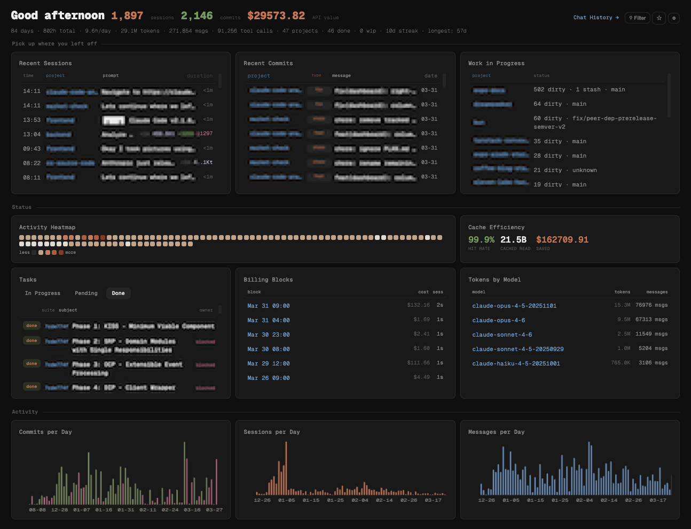
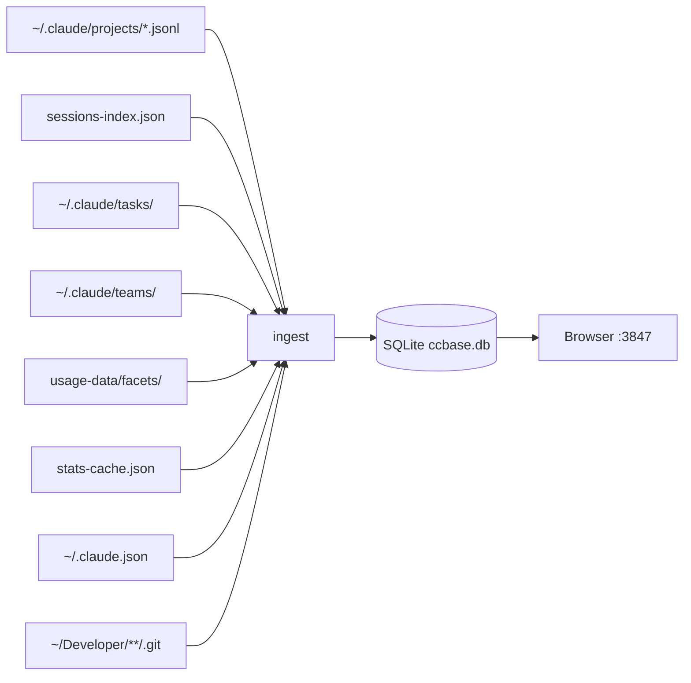

# ccbase

[](https://opensource.org/licenses/MIT)
[](https://bun.sh)
[](https://www.typescriptlang.org/)

Local analytics dashboard, searchable chat history, cost tracking, and full session replay for [Claude Code](https://docs.anthropic.com/en/docs/claude-code). Requires [Bun](https://bun.sh) v1.3+. All data stays on your machine.



Reads `~/.claude/` and gives you:

- Spend breakdown by project and model
- Tool error rates and failure patterns
- Coding patterns: time of day, session duration, streaks
- Full conversation history with search and replay
- Project health across all repos
- Team tasks, skill usage, and cache efficiency

## Quick Start

```bash
git clone https://github.com/ramonclaudio/ccbase.git
cd ccbase
bun install

# Ingest your Claude Code data (~20s for 300K+ messages)
bun run ingest

# Launch the dashboard
bun start
```

Open [http://localhost:3847](http://localhost:3847). First run auto-ingests if no database exists.

## Commands

### Dashboard and Chat

```bash
ccbase serve [port]     # Live dashboard + chat viewer (default: 3847)
ccbase export [path]    # Static HTML snapshot of the dashboard
```

### CLI Analytics

```bash
ccbase log              # Today's sessions grouped by project
ccbase log --yesterday  # Yesterday's sessions
ccbase log --week       # This week's sessions
ccbase log 2026-03-15   # Sessions for a specific date

ccbase tasks            # Open tasks across all projects/teams
ccbase tasks --done     # Recently completed tasks

ccbase wip              # Work in progress: dirty repos, stashes, active sessions
ccbase progress         # What shipped this week: commits, completed tasks

ccbase search "query"   # Full-text search across all conversations
ccbase sql "SELECT ..." # Raw SQL against the database
```

### Data Management

```bash
ccbase ingest           # Parse ~/.claude/ data into SQLite
ccbase ingest --force   # Drop everything and re-ingest from scratch
```

> [!WARNING]
> `ingest --force` drops all tables and rebuilds from scratch. Your `~/.claude/` data is never modified, but the local database is wiped.

## What It Tracks

<details>
<summary><strong>Dashboard Widgets</strong></summary>

| Category | Widgets |
|:---|:---|
| Activity | Sessions per day, messages per day, hour of day distribution, session duration histogram, activity heatmap |
| Projects | Sessions by project, tokens by project, project health and staleness |
| Current Work | Tasks (in progress/pending/done), work in progress (dirty repos, stashes), recent sessions |
| Commits | Recent commits, commits per day, commit type breakdown (feat/fix/refactor/chore) |
| Cost | Billing blocks (5-hour windows), tokens by model, total API value |
| Tools | Tool calls per day, tool duration, tool error rates (Bash, Read, Edit, Write, Grep, etc.) |
| Skills | Skill invocation counts and error rates (commit, teams, simplify, audit, etc.) |
| Performance | Turn latency (avg/P50/P95), cache efficiency (hit rate, tokens saved, cost saved) |
| Infrastructure | MCP server usage, web search/fetch counts |
| Insights | Session outcomes, Claude helpfulness ratings, session summaries |

</details>


### Chat History Viewer

- Sidebar with all conversations, searchable
- Full message rendering with markdown
- Collapsible thinking blocks with character count
- Tool call cards with expandable input/output
- Inline Edit diffs with syntax highlighting
- Tool call timeline visualization
- Toggle controls for thinking, tools, progress, timeline
- Deep linking: `http://localhost:3847/chat?s=SESSION_ID`

## Configuration

### Project directory

Scans `~/Developer` for git repos by default. Override with `CCBASE_DEV_DIR`:

```bash
CCBASE_DEV_DIR=~/projects ./dist/ccbase ingest
```

Finds repos at `$CCBASE_DEV_DIR/*/` and `$CCBASE_DEV_DIR/*/*/`.

### Git author filtering

Commits are filtered to your git identity via `git config user.name` and `user.email`. No manual config needed.

### Widget visibility

Settings panel (gear icon) to show/hide any widget. Persists in localStorage.

### Theme

Dark and light mode. Defaults to OS preference.

## How It Works

### Data Flow



### Ground Truth

All counts, tokens, and cost metrics come from `conversation_messages`, a direct parse of the JSONL files. This is the most accurate source because it includes agent/subagent sessions that sessions-index misses.

The `sessions` table adds metadata not in JSONL: project paths, lines changed, git branch, PR links, session slugs.

### Database

Single SQLite file at [`data/ccbase.db`](data/). See [schema](src/db/schema.ts) for full DDL.

<details>
<summary><strong>Tables</strong></summary>

| Table | Purpose |
|:---|:---|
| `conversation_messages` | Every message from every conversation (300K+ rows). The source of truth for tokens, tool calls, errors, thinking blocks. |
| `sessions` | Session metadata from sessions-index.json. Project path, duration, lines changed, git context, PR data. |
| `commits` | Git commit history from your repos. Hash, author, date, conventional commit type/scope. |
| `tasks` | Team task state from `~/.claude/tasks/`. Status, owner, blocking relationships. Internal agent registrations are filtered out. |
| `projects` | Filesystem scan of your dev directory. Git presence, CLAUDE.md presence, last activity dates. |
| `project_git_state` | Current git state per repo: dirty files, stash count, branch count, current branch. |
| `billing_blocks` | 5-hour billing windows with cost, token count, and burn rate. |
| `session_facets` | Quality ratings from Claude Code's usage-data: outcomes, helpfulness, session type. |
| `app_meta` | Key-value metadata: startups, first use date, model pricing, file history stats. |
| `github_repos` | Maps GitHub repo slugs to local filesystem paths. |
| `conversation_fts` | FTS5 full-text index on conversation content. Powers search. |

</details>

### Ingestion Performance

300K+ messages in ~20 seconds. Git operations timeout after 10-15 seconds to avoid hanging on unreachable repos.

## Raw SQL Access

The database is the API. Read-only: `SELECT`, `PRAGMA`, and `EXPLAIN` only.

<details>
<summary><strong>Example queries</strong></summary>

```bash
# Sessions by project this month
ccbase sql "SELECT project_path, COUNT(*) as sessions
  FROM sessions WHERE started_at > strftime('%s','2026-03-01')*1000
  GROUP BY project_path ORDER BY sessions DESC"

# Most error-prone tools
ccbase sql "SELECT tool_name, COUNT(*) as calls,
  SUM(CASE WHEN is_error=1 THEN 1 ELSE 0 END) as errors
  FROM conversation_messages WHERE tool_name IS NOT NULL
  GROUP BY tool_name ORDER BY errors DESC LIMIT 10"

# Daily token spend
ccbase sql "SELECT SUBSTR(datetime(timestamp,'localtime'),1,10) as day,
  SUM(input_tokens+output_tokens) as tokens
  FROM conversation_messages WHERE timestamp LIKE '20%'
  GROUP BY day ORDER BY day DESC LIMIT 7"
```

</details>

## Stack

Zero runtime dependencies. Bun + SQLite all the way down.

| Layer | Technology |
|:---|:---|
| Runtime | [Bun](https://bun.sh) |
| Database | SQLite via `bun:sqlite` (WAL mode, 128MB cache, 1GB mmap) |
| Server | `Bun.serve()` with routes object |
| Frontend | Vanilla HTML/CSS/JS |
| Typography | [Geist Mono](https://vercel.com/font) (served locally) |
| Charts | Canvas API |
| Syntax highlighting | Custom zero-dep tokenizer (11 languages) |
| Markdown | Custom zero-dep parser |
| Search | SQLite FTS5 |

## Data Privacy

Read-only against `~/.claude/`. Never modifies your Claude Code data. The SQLite database and exports stay in the project's `data/` directory. No network requests except `localhost`.

## License

MIT
