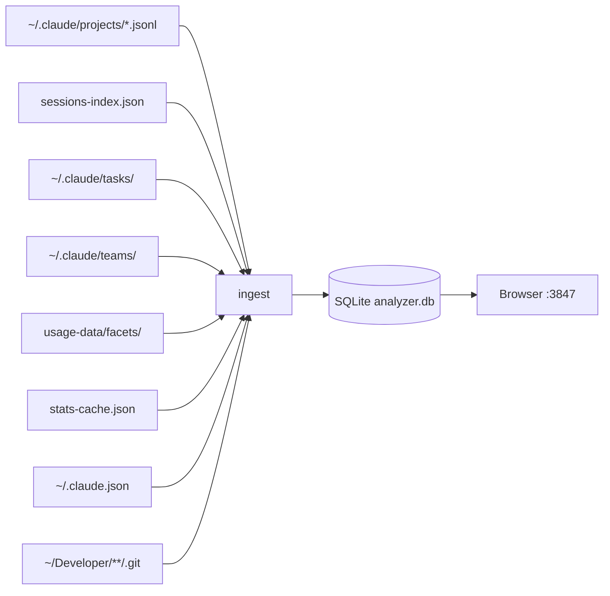

# Claude Pulse

[](https://opensource.org/licenses/MIT)
[](https://bun.sh)
[](https://www.typescriptlang.org/)

Local analytics dashboard and chat history viewer for [Claude Code](https://docs.anthropic.com/en/docs/claude-code). Turns your conversation history into a searchable database with a live web dashboard, cost tracking, and full session replay.

> [!IMPORTANT]
> All data stays on your machine. Zero runtime dependencies. No API calls, no telemetry, no accounts.

<!-- Add screenshots/GIFs here after first deploy -->
<!--  -->
<!--  -->

## Why Claude Pulse

Claude Code stores rich data locally but gives you no way to see it. Claude Pulse reads that data and shows you:

- How much you're spending and on which projects
- Which tools fail the most and why
- Your coding patterns (time of day, session duration, streaks)
- Full conversation history with search and session replay
- Project health across all your repos
- Team task status and skill error rates

## Quick Start

```bash
# Install
git clone https://github.com/ramonclaudio/claude-pulse.git
cd claude-pulse
bun install

# Build
bun run build

# Ingest your Claude Code data (takes ~20s for 300K+ messages)
./dist/claude-pulse ingest

# Launch the dashboard
./dist/claude-pulse serve
```

Open [http://localhost:3847](http://localhost:3847).

> [!TIP]
> Skip the build and run directly with `bun run src/index.ts serve`. First run auto-ingests if no database exists.

## Requirements

- [Bun](https://bun.sh) v1.3+
- [Claude Code](https://docs.anthropic.com/en/docs/claude-code) installed with conversation history at `~/.claude/`

## Commands

### Dashboard and Chat

```bash
claude-pulse serve [port]     # Live dashboard + chat viewer (default: 3847)
claude-pulse export [path]    # Static HTML snapshot of the dashboard
```

### CLI Analytics

```bash
claude-pulse log              # Today's sessions grouped by project
claude-pulse log --yesterday  # Yesterday's sessions
claude-pulse log --week       # This week's sessions
claude-pulse log 2026-03-15   # Sessions for a specific date

claude-pulse tasks            # Open tasks across all projects/teams
claude-pulse tasks --done     # Recently completed tasks

claude-pulse wip              # Work in progress: dirty repos, stashes, active sessions
claude-pulse progress         # What shipped this week: commits, completed tasks

claude-pulse search "query"   # Full-text search across all conversations
claude-pulse sql "SELECT ..." # Raw SQL against the database
```

### Data Management

```bash
claude-pulse ingest           # Parse ~/.claude/ data into SQLite
claude-pulse ingest --force   # Drop everything and re-ingest from scratch
```

> [!WARNING]
> `ingest --force` drops all tables and rebuilds from scratch. Your `~/.claude/` data is never modified, but the local database is wiped.

## What It Tracks

<details>
<summary><strong>Dashboard Widgets</strong></summary>

| Category | Widgets |
|:---|:---|
| Activity | Sessions per day, messages per day, hour of day distribution, session duration histogram, activity heatmap |
| Projects | Sessions by project, tokens by project, project health and staleness |
| Current Work | Tasks (in progress/pending/done), work in progress (dirty repos, stashes), recent sessions |
| Commits | Recent commits, commits per day, commit type breakdown (feat/fix/refactor/chore) |
| Cost | Billing blocks (5-hour windows), tokens by model, tokens by project, total API value |
| Tools | Tool calls per day, tool duration, tool error rates (Bash, Read, Edit, Write, Grep, etc.) |
| Skills | Skill invocation counts and error rates (commit, teams, simplify, audit, etc.) |
| Performance | Turn latency (avg/P50/P95), cache efficiency (hit rate, tokens saved, cost saved) |
| Infrastructure | MCP server usage, web search/fetch counts |
| Insights | Session outcomes, Claude helpfulness ratings, session summaries |

</details>

<details>
<summary><strong>Stats Bar Metrics</strong></summary>

Sessions, commits, projects, tasks (done/wip/pending), API value, total tokens, messages, tool calls, thinking blocks, agents, errors, plan mode sessions, cache hit %, turn latency, total coding time, current streak, startups, first use date.

</details>

### Chat History Viewer

- Sidebar with all conversations, searchable
- Full message rendering with markdown
- Collapsible thinking blocks with character count
- Tool call cards with expandable input/output
- Inline Edit diffs with syntax highlighting
- Tool call timeline visualization
- Toggle controls for thinking, tools, progress, timeline
- Deep linking: `http://localhost:3847/chat?s=SESSION_ID`

## Configuration

### Project directory

By default, Claude Pulse scans `~/Developer` for git repos (one and two levels deep). Override with:

```bash
ANALYZER_DEV_DIR=~/projects ./dist/claude-pulse ingest
```

The scanner finds git repos at `$ANALYZER_DEV_DIR/*/` and `$ANALYZER_DEV_DIR/*/*/`. Non-git directories at the first level are treated as parent directories and scanned one level deeper.

### Git author filtering

Commits are filtered to your git identity. The tool reads `git config user.name` and the username from `git config user.email` to match commit authors. No manual configuration needed.

### Widget visibility

The dashboard has a settings panel (gear icon) where you can show/hide any widget. Preferences persist in localStorage.

### Theme

Dark and light mode, toggled via the button in the header. Defaults to your OS preference.

## How It Works

### Data Flow



### Ground Truth

All counts, tokens, and cost metrics are derived from `conversation_messages`, which is a direct parse of the JSONL conversation files. This is the most accurate source because it includes agent/subagent sessions that the sessions-index misses.

The `sessions` table (from `sessions-index.json`) provides metadata that doesn't exist in JSONL: project paths, lines added/removed, git branch, PR links, and session slugs.

### Database

Single SQLite file at [`data/analyzer.db`](data/). See [schema](src/db/schema.ts) for full DDL.

<details>
<summary><strong>Tables</strong></summary>

| Table | Purpose |
|:---|:---|
| `conversation_messages` | Every message from every conversation (300K+ rows). The source of truth for tokens, tool calls, errors, thinking blocks. |
| `sessions` | Session metadata from sessions-index.json. Project path, duration, lines changed, git context, PR data. |
| `commits` | Git commit history from your repos. Hash, author, date, conventional commit type/scope. |
| `tasks` | Team task state from `~/.claude/tasks/`. Status, owner, blocking relationships. Internal agent registrations are filtered out. |
| `projects` | Filesystem scan of your dev directory. Git presence, CLAUDE.md presence, last activity dates. |
| `project_git_state` | Current git state per repo: dirty files, stash count, branch count, current branch. |
| `billing_blocks` | 5-hour billing windows with cost, token count, and burn rate. |
| `session_facets` | Quality ratings from Claude Code's usage-data: outcomes, helpfulness, session type. |
| `app_meta` | Key-value metadata: startups, first use date, model pricing, file history stats. |
| `github_repos` | Maps GitHub repo slugs to local filesystem paths. |
| `conversation_fts` | FTS5 full-text index on conversation content. Powers search. |

</details>

### Ingestion Performance

A typical ingest processes 300K+ messages in ~20 seconds. The conversation step is the heaviest (stream-parsing all JSONL files). Git operations have 10-15 second timeouts to prevent hangs on unreachable repos.

## Raw SQL Access

The database is the API. Query it directly.

> [!NOTE]
> Only `SELECT`, `PRAGMA`, and `EXPLAIN` queries are allowed.

<details>
<summary><strong>Example queries</strong></summary>

```bash
# Sessions by project this month
claude-pulse sql "SELECT project_path, COUNT(*) as sessions
  FROM sessions WHERE started_at > strftime('%s','2026-03-01')*1000
  GROUP BY project_path ORDER BY sessions DESC"

# Most error-prone tools
claude-pulse sql "SELECT tool_name, COUNT(*) as calls,
  SUM(CASE WHEN is_error=1 THEN 1 ELSE 0 END) as errors
  FROM conversation_messages WHERE tool_name IS NOT NULL
  GROUP BY tool_name ORDER BY errors DESC LIMIT 10"

# Daily token spend
claude-pulse sql "SELECT SUBSTR(datetime(timestamp,'localtime'),1,10) as day,
  SUM(input_tokens+output_tokens) as tokens
  FROM conversation_messages WHERE timestamp LIKE '20%'
  GROUP BY day ORDER BY day DESC LIMIT 7"
```

</details>

## Stack

Zero runtime dependencies. Everything is built on Bun primitives.

| Layer | Technology |
|:---|:---|
| Runtime | [Bun](https://bun.sh) |
| Database | SQLite via `bun:sqlite` (WAL mode, 128MB cache, 1GB mmap) |
| Server | `Bun.serve()` with routes object |
| Frontend | Vanilla HTML/CSS/JS (no framework, no bundler) |
| Charts | Canvas API (no chart library) |
| Syntax highlighting | Custom zero-dep tokenizer (JS/TS, Python, Bash, SQL, Go, Rust, CSS, JSON, YAML, Diff) |
| Markdown | Custom zero-dep parser (headings, lists, tables, code blocks, inline formatting) |
| Search | SQLite FTS5 |

## Data Privacy

> [!IMPORTANT]
> Claude Pulse is read-only against your `~/.claude/` directory. It never modifies Claude Code's files.

The SQLite database and any exported HTML stay in the `data/` directory of the project. No data leaves your machine. No network requests except `localhost` for the dashboard.

## Contributing

PRs welcome. The codebase is 34 files, ~3K lines of TypeScript, and two HTML pages.

```text
src/
  index.ts              CLI entry point
  commands/             Command handlers (serve, log, search, etc.)
  db/                   SQLite connection, schema, query helpers
  ingest/               Data parsers (conversations, sessions, projects, tasks, etc.)
  pages/                Dashboard and chat viewer HTML
  utils/                Dates, formatting, git, syntax highlighting, path helpers
```

See [`src/index.ts`](src/index.ts) for the entry point, [`src/db/schema.ts`](src/db/schema.ts) for the database schema, and [`src/commands/serve.ts`](src/commands/serve.ts) for all 40+ API endpoints.

## License

MIT

## Star History

[](https://star-history.com/#ramonclaudio/claude-pulse&Date)
